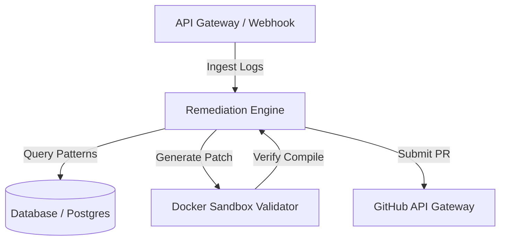

# Akesis

```text
Ecosystem: CRLabs AI
Category: AI-powered Engineering Platform
Status: Research & Product Discovery
Domain: Closed-Loop CI/CD Remediation
```

Akesis is an intelligent engineering platform that assists software teams by analyzing pipeline failures, identifying root causes, validating patch fixes, and improving engineering productivity through reliable AI-assisted automation.

Akesis is built on engineering-first principles. We prioritize reliability, observability, security, and maintainability over speed.

---

## Technical Architecture Overview

Akesis is structured as a closed-loop remediation pipeline:



*Alternative Text Description: The Akesis system ingests pipeline logs via webhook through the Ingress API Gateway. The Remediation Engine processes the logs, queries Postgres for historical patterns, constructs a code patch, and runs it inside an isolated Docker sandbox. Once compilation and verification succeed, the engine calls the GitHub API to submit an approval-gated PR.*

---

## Directory Topology

To support horizontal scaling of packages, services, and interfaces, the codebase follows a monorepo layout:

```text
akesis/
├── .github/                  # GitHub configurations, templates, and CODEOWNERS
│   └── workflows/            # Continuous Integration & Delivery pipelines
├── adr/                      # Architecture Decision Records (immutable logs)
├── architecture/             # High-level architecture specs and database aggregate maps
├── assets/                   # Non-branding visual diagrams and charts
├── design/                   # UI/UX design tokens and interface designs
├── docs/                     # Documentation index and playbook guidelines
├── rfcs/                     # Architecture proposal sandboxes
├── roadmap/                  # Execution milestones and planning metrics
├── scripts/                  # Workstation configuration and lint utilities
├── src/                      # Source Code Core
│   ├── apps/                 # Interface Entry Points
│   │   ├── api/              # Backend service runtime
│   │   ├── web/              # User interface environment
│   │   └── cli/              # Local developer command-line client
│   ├── packages/             # Decoupled Core Modules
│   │   ├── agent-runtime/    # Remediation execution loops
│   │   ├── rag/              # Retrieval augmented generation system
│   │   ├── sdk/              # Client pipeline integration library
│   │   └── shared/           # Common data schemas and models
│   └── infra/                # Terraform infrastructure definitions
└── tests/                    # Integration & End-to-End verification suites
```

---


## V1 Status & Architecture

Akesis V1 is a self-healing CI/CD agent designed to ingest Python GitHub Actions failures, synthesize targeted fix proposals via Google Gemini, validate patches in isolated Docker sandboxes, require explicit human authorization via Slack, and deliver Pull Requests with full audit trails.

* **Automated Benchmark Suite:** 12/12 vertical-slice scenarios passing (100% automated regression baseline).
* **Local Runtime Verification:** Verified `/health/liveness`, `/health/readiness`, and webhook HMAC signature rejection/acceptance against local API runtime.
* **Mandatory Human Approval:** Zero autonomous code mutations or auto-merges; all Git mutations require signed, durable human approval in PostgreSQL.
* **Validation Engine:** Isolated Docker execution (`akesis-validator:v1`, `--network none`, `--cap-drop ALL`).
* **Live Integration Readiness:** Live smoke test prepared and documented in [`docs/07-operations/v1-validation-runbook.md`](docs/07-operations/v1-validation-runbook.md).
* **V1 Core Boundaries:** Single Python repository scope, max 2 target files / 100 patch lines, protected workflow file rejection.
---

## Quality Gates & Verification

All code merged to `main` must satisfy these criteria:
*   **Trunk-Based Zero-Drift:** Feature branches must be merged via squash-and-merge in under 72 hours.
*   **Static Analysis Gating:** Commits must compile with zero linter errors or warnings.
*   **Conventional Commits:** Commit messages must follow Conventional Commits 1.0.0.
*   **Coverage Baselines:** Core logic changes require unit and integration tests.

---

## Documentation Map & Navigation
*   [`CONTRIBUTING.md`](CONTRIBUTING.md) — Local workstation setup and review processes.
*   [`SECURITY.md`](SECURITY.md) — Vulnerability disclosure protocols and secrets compliance.
*   [`/architecture`](architecture/README.md) — Core system specifications and database aggregates.
*   [`/adr`](adr/README.md) — Architecture Decision Records index.
*   [`/rfcs`](rfcs/README.md) — Technical proposal sandboxes.
*   [`/roadmap`](roadmap/README.md) — Engineering milestones.
*   [`/docs`](docs/README.md) — Playbook guidelines index.

---
<sub>**CRLabs AI** · Systems Thinking · Technical Rigor</sub>
