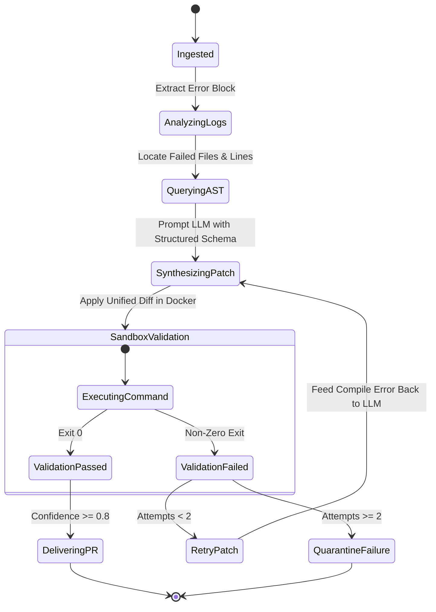

# AI Agent Architecture: Akesis

This document defines the runtime agent design, state representations, tool interfaces, and decision boundaries.

---

## 1. Agent Design Philosophy: Deterministic State Machine
Akesis rejects unpredictable, open-ended autonomous agent loops. Instead, our agent operates as a **finite state machine with bounded transitions** and explicit validation checkpoints.

---

## 2. Agent Tools & Capabilities
The Diagnostic Agent has access to a strictly bounded set of tools:
1.  `log_extractor(raw_log: str) -> ErrorSignature`: Identifies error stack trace, file path, and line numbers.
2.  `ast_reader(file_path: str, line_no: int) -> CodeContext`: Reads the AST node and surrounding 30 lines of code.
3.  `diff_validator(patch: str) -> bool`: Verifies that the patch is valid unified diff syntax.
4.  `sandbox_runner(patch: str, test_cmd: str) -> ExecutionResult`: Executes the patch in Docker and returns exit code, stdout, and stderr.

---

## 3. Decision & Confidence Thresholds
*   **Confidence Calculation:** Model generates a confidence score ($0.0 - 1.0$) based on error clarity and code context sufficiency.
*   **Threshold Gates:**
    *   $	ext{Confidence} \ge 0.8$ AND $	ext{Sandbox Exit} = 0 \implies 	extbf{Deliver Pull Request}$.
    *   $	ext{Confidence} < 0.8$ OR $	ext{Sandbox Exit} 
e 0 \implies 	extbf{Quarantine / Flag for Human Review}$.
