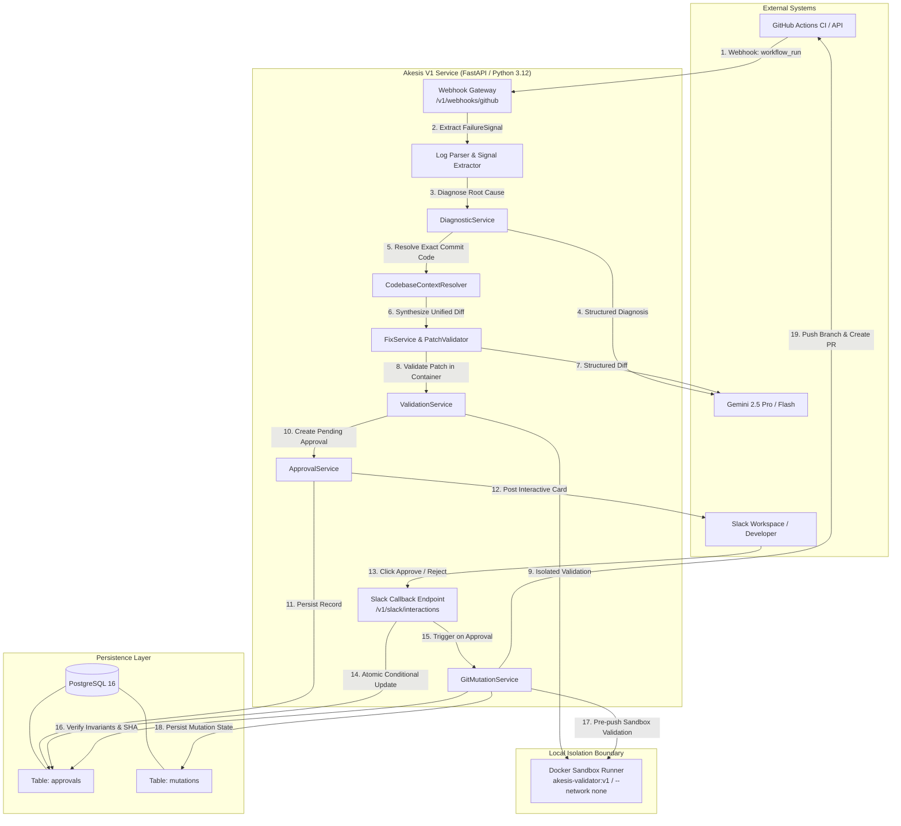

# System Architecture: Akesis V1

```text
Status: Approved V1 Authoritative Architecture
Architecture Style: Modular Monolith / Single-Service Control Plane
Persistence: PostgreSQL 16 (Durable Approval & Mutation State)
Tooling: Python 3.12+ / uv
Logging: structlog with Correlation IDs
```

---

## 1. High-Level System Landscape

Akesis V1 is architected as a modular, safety-first self-healing CI/CD platform. It integrates with GitHub Actions to detect pipeline failures, extract root causes, synthesize minimal code patches, validate fixes in Docker sandboxes, require explicit human authorization, and deliver Pull Requests.

```
Webhook Ingestion ──> Log Parsing ──> Gemini Diagnosis ──> Context Retrieval ──> Fix Synthesis ──> Sandbox Validation ──> Human Approval Gate (Slack / Postgres) ──> Controlled Git Mutation ──> GitHub PR Delivery
```



---

## 2. Core Subsystems & Components

### 2.1 Ingestion & Diagnostic Pipeline
1. **Webhook Gateway (`src/apps/api/routes.py`):** Ingests `workflow_run` events, verifies HMAC-SHA256 signatures, and acknowledges immediately.
2. **Log Parser (`src/packages/shared/log_parser.py`):** Strips ANSI formatting and extracts structured `FailureSignal` (category, error type, target file, stack frames).
3. **Diagnostic Engine (`src/packages/shared/diagnostic_service.py`):** Uses structured JSON generation with Gemini to produce evidence-backed `DiagnosisProposal`.
4. **Codebase Context Resolver (`src/packages/shared/context_resolver.py`):** Materializes repository at exact failing commit SHA via `GitRepositoryCheckoutManager` and extracts bounded `CodeEvidence`.

### 2.2 Synthesis & Sandbox Validation
1. **Fix Proposal Engine (`src/packages/shared/fix_service.py`):** Prompts LLM for minimal unified diffs bounded by strict patch budgets (max 2 files, 120 lines, 8KB).
2. **Patch Validator (`src/packages/shared/patch_validator.py`):** Verifies unified diff syntax, target-file grounding, and blocks protected files (`.github/workflows/`).
3. **Docker Sandbox Runner (`src/packages/sdk/sandbox_runner.py`):** Runs isolated container (`akesis-validator:v1`) with `--network none`, `--cap-drop ALL`, non-root execution, and verbatim `git apply` (no whitespace fixing).
4. **Validation Service (`src/packages/shared/validation_service.py`):** Executes deterministic allowlisted validation commands (`pytest`, `ruff`, `mypy`, `python -m compileall`).

### 2.3 Human-in-the-Loop Approval & PostgreSQL Persistence
1. **Approval Gate (`src/packages/shared/approval_service.py`):** Creates approval records with unique deterministic IDs and dispatches Slack Block Kit cards.
2. **PostgreSQL Persistence (`src/packages/database/`):** Durably stores `approvals` and `mutations` tables with atomic conditional SQL transitions.
3. **Slack Interaction Endpoint (`/v1/slack/interactions`):** Validates Slack HMAC-SHA256 signatures, prevents replay attacks, records decisions, and updates Slack cards in-place.

### 2.4 Controlled Git Mutation & PR Creation
1. **Pre-flight & SHA Verification:** Enforces proposal validity, sandbox validation exit code 0, human approval, and exact commit SHA match.
2. **Deterministic Fix Branch:** Generates collision-resistant branch (`akesis/fix/<incident>/<proposal>`) and protects base branches (`main`, `master`, `develop`).
3. **Pre-Push Validation:** Re-validates the patched working tree in Docker prior to pushing remote branch.
4. **GitHub PR Delivery:** Uses `GitHubClient` to push branch and open a Pull Request with complete audit metadata.

---

## 3. Strict Non-Negotiable Safety Boundaries

* **No Autonomous Remediation:** Git mutation cannot execute without an approved `ApprovalRecord`.
* **No Auto-Merge:** Pull Requests require manual human merge on GitHub.
* **No Unrestricted Shell Execution:** Only allowlisted validation commands run inside unprivileged containers.
* **No Distributed Message Brokers:** Uses PostgreSQL and FastAPI background tasks; no Celery, Redis, or Kafka.
