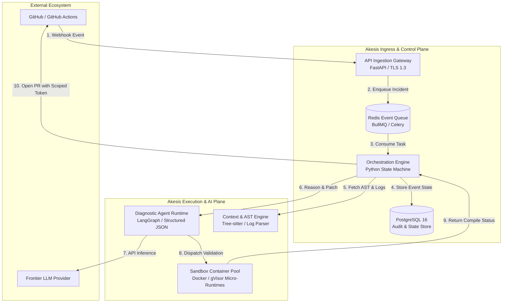

# System Architecture: Akesis

```text
Status: Approved Architectural Baseline
Security Boundary: Tier 1 Zero-Trust Container Isolation
```

---

## 1. High-Level System Landscape

Akesis is designed as a distributed, event-driven remediation platform.



---

## 2. Trust & Security Boundaries

1.  **Ingress Boundary:** Public-facing API Gateway terminating TLS 1.3. Validates HMAC-SHA256 signatures before parsing webhooks.
2.  **Internal Control Plane:** Orchestration service, PostgreSQL database, and Redis queue reside in an isolated Virtual Private Cloud (VPC) with no public ingress.
3.  **Execution Sandbox Boundary (Strict Isolation):** Docker sandbox containers execute untrusted code in an unprivileged, capability-dropped runtime with dedicated CPU/memory limits and read-only host mounts.
4.  **Egress Boundary:** Outbound calls to GitHub API and LLM providers use scoped, ephemeral tokens with strict rate limiting.
