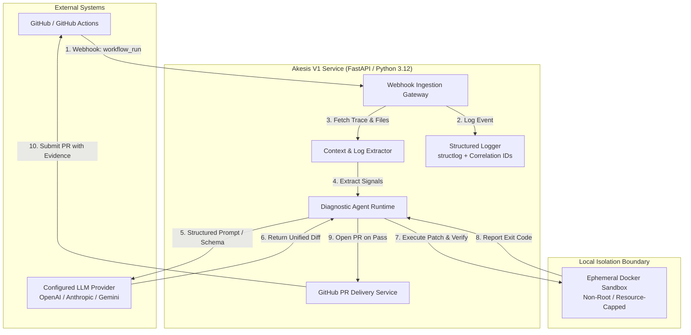

# System Architecture: Akesis V1

```text
Status: Approved V1 Baseline (Vertical Slice)
Architecture Style: Modular Monolith / Single-Service Control Plane
Tooling: Python 3.12+ / uv
Logging: structlog with Correlation IDs
```

---

## 1. High-Level System Landscape

Akesis V1 is architected as a complete, robust vertical slice centered around a direct pipeline:

```
Event Ingestion ──> Context Collection ──> Diagnosis ──> Remediation ──> Validation ──> Human Decision ──> Resolution
```



---

## 2. V1 Architectural Decisions

1. **Modular Single Service:** The ingestion gateway, context extractor, agent coordinator, and delivery engine run as a clean, modular Python application. No distributed task queues or microservices are required for V1.
2. **Provider-Agnostic LLM Interface:** A clean abstraction layer wraps the primary configured model (e.g. Claude 3.5 Sonnet or GPT-4o) using Pydantic schemas. No multi-tier routing or dynamic model selection agents in V1.
3. **Structured Contextual Logging:** All components log via `structlog` with correlation IDs (`incident_id`, `repo_id`, `run_id`).
4. **Pragmatic Docker Sandboxing:** Ephemeral container spawned on the host Docker daemon. Network access is disabled by default, enabled only during dependency installation steps.
